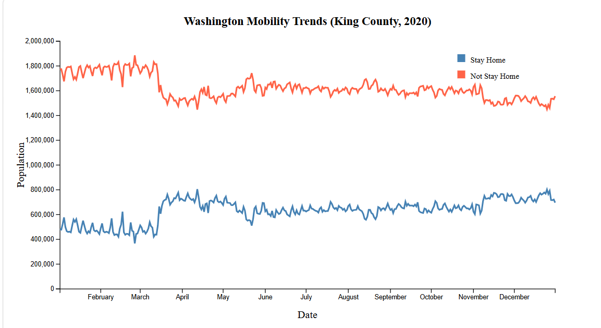

# Washington Mobility Trends Visualization (2020)

This project is a multi-line time series visualization created with D3.js.  
The chart explores mobility patterns in King County, Washington during 2020 using daily mobility statistics data.

The visualization compares two mobility trends over time:

- Population staying at home
- Population not staying at home

The goal of the visualization is to show how movement patterns changed throughout the COVID-19 pandemic period in 2020.

---

## Visualization

---

## Tools Used

- D3.js
- JavaScript
- HTML
- CSS
- Git Bash
- VS Code

---

## Resources

D3.js (https://d3js.org/)

---

## Dataset

**Dataset:** Daily Mobility Statistics  
**Source:** Bureau of Transportation Statistics (BTS)

Data used in this project was filtered for:
- Washington State
- King County
- Year 2020

Source Reference: https://data.bts.gov/Research-and-Statistics/Daily-Mobility-Statistics/w96p-f2qv/about_data

---

## Project Features

- Multi-line time series chart
- External CSV data loading with D3
- SVG-based visualization
- Time scale and linear scale axes
- Axis labels and chart title
- Legend explaining each data series
- CSS styling for chart presentation

---
