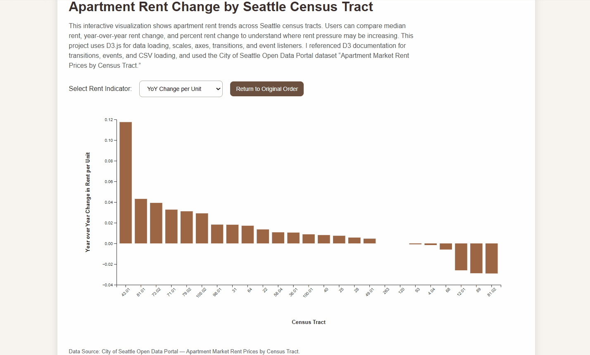

# Seattle Apartment Rent Visualization (2024)

This project is an interactive bar chart visualization created with D3.js.  
The chart explores apartment rent trends across Seattle census tracts using apartment market rent data.

The visualization compares multiple apartment rent indicators:

- Median apartment rent per unit
- Median apartment rent per square foot
- Year-over-year rent change per unit
- Year-over-year rent change per square foot

The goal of the visualization is to show how apartment rent patterns and rent pressure vary across Seattle neighborhoods.

---

## Visualization

---

## Tools Used

- D3.js
- JavaScript
- HTML
- CSS
- Git Bash
- VS Code

---

## Resources

D3.js (https://d3js.org/)

---

## Dataset

**Dataset:** Apartment Market Rent Prices by Census Tract  
**Source:** City of Seattle Open Data Portal

Data used in this project includes:
- Seattle census tracts
- Apartment market rent values
- Year-over-year rent changes
- 2024 housing market information

Source Reference: https://data.seattle.gov/

---

## Project Features

- Interactive bar chart visualization
- External CSV data loading with D3
- Dropdown menu interaction
- Button interaction for sorting values
- Animated transitions
- Hover tooltip interactions
- SVG-based visualization
- Axis labels and chart title
- CSS styling for chart presentation

---
