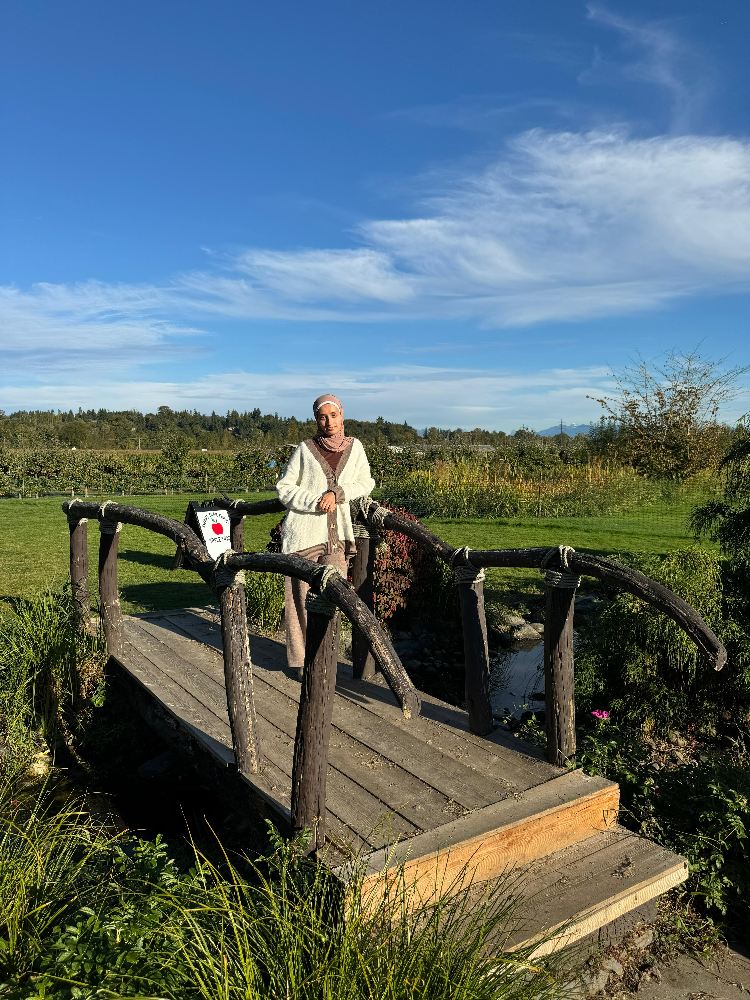

# Public-Data-Investigations-UW-Bothell-2026
Showcases all work done in Public Data Investigations course at UW Bothell Spring of 2026

# Firdaus Thalib

## About Me

I am a senior in the **Data Visualization program at UW Bothell** with a minor in **Health Studies**, graduating Spring Quarter. My past projects have reflected my interests in public health issues such as examining health and education disparities, as well as environmental issues to uncover the climate crisis. I have used tools such as **ArcGIS, R, and Python,** and have experienced building interactive dashboards and visualizations for the purpose of influencing public policy and program improvements.  

## Skills and Interests
- **Data Visualization:** ArcGIS, Tableau, interactive dashboards built with R
- **Data Analysis:** R, Python, SPSS
- **Areas of Interest:** Public health, climate & environmental data, K-12 and higher education

