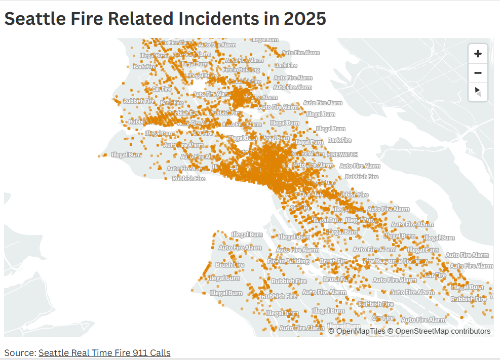

# Seattle Fire Incidents Visualization (2025)

## Overview

This visualization maps fire-related incidents in Seattle during 2025 using 911 dispatch data from the Seattle Fire Department. The dataset was sourced from the City of Seattle’s open data portal (Seattle Real-Time Fire 911 Calls) and includes incident type, date/time, and geographic coordinates. For this map, other responses were removed to focus only on fire-related events.

## Visualization & Analysis

The map displays each incident by location and displays incident type when mouse hovers over the data points. Lower-severity incidents such as alarms and smoke investigations appear more frequent and widely distributed, while higher-severity fires are less common and appear in smaller clusters.

## Image of Visualization

## Flourish Link

https://public.flourish.studio/visualisation/28548703/

## Data Source

City of Seattle Open Data Portal – Seattle Real-Time Fire 911 Calls Dataset
