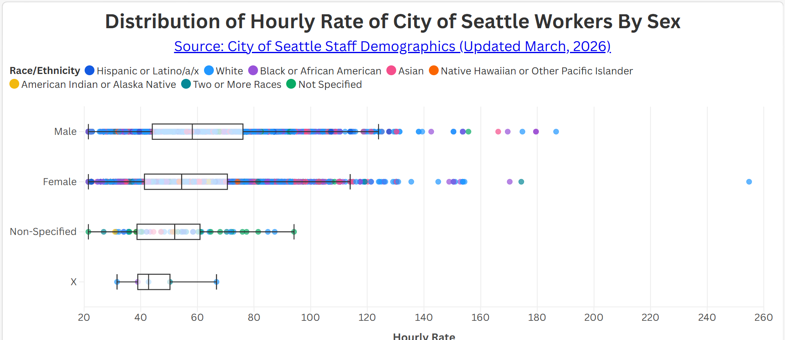
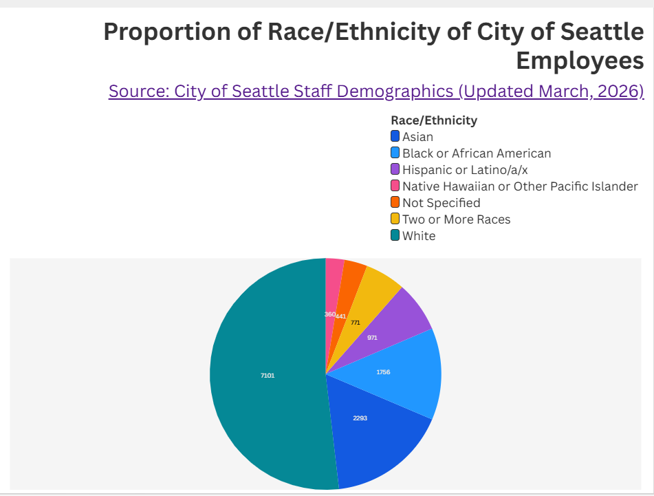

# City of Seattle Staff Demographics (March 2026)

## Overview

These visualizations help show the overall effectiveness of the City of Seattle Staff Demographics dataset, which covers 7 attributes and nearly 14,000 people and is updated monthly by the Seattle Department of Human Resources. While the box plot helps display potential pay gap between male and female, the pie chart helps display the proportion of race/ethnicity of the workforce. Only a small portion were undefined observations, which means that the dataset is mostly complete.

Source: https://data.seattle.gov/City-Administration/City-of-Seattle-Staff-Demographics/5avq-r9hj/about_data

## Visualizations
### Chart 1 Display

This chart will be beneficial to draw on wage equity analysis by sex and help influence policy and draw awareness. However, a portion of observations were marked 'non-specified' which may indicate lack of important data being missing and/or witheld for privacy reasons. This may make analyses by sex less accurate and inflated. A smaller amount of the data was labelled "x" which may be dropped as it reflects only a few points. Another potential limitation is that the dataset does not provide years of occupation and work-level, which may influence hourly rate. 

Access this Flourish Visualization: https://public.flourish.studio/visualisation/28658940/

### Chart 2 Display

The proportion of race/ethnicity of this dataset is properly structured and will help to understand representation and diversity. Only a smaller count was "not specified." This visualization is good for a broad overview and push for more research into potential hiring biases and other practicies that limit diversity in Seattle's workforce.

Access this Flourish Visualization: https://public.flourish.studio/visualisation/28656650/

 
